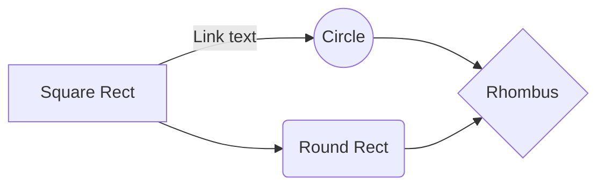

# LabFlow
Repositorio de github para el proyecto de reservas de laboratorios de la Escuela de Lenguajes UCR (no oficial)
---

```mermaid
graph LR
A[Square Rect] -- Link text --> B((Circle))
A --> C(Round Rect)
B --> D{Rhombus}
C --> D
```
